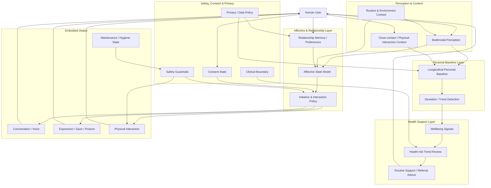

# Concept Architecture

This document describes the **public conceptual architecture** of Embodied Companion Health. It intentionally avoids implementation-sensitive sensor layouts, material specifications, fluid recipes, clinical algorithms, or device-level mechanisms.

## High-level architecture



## Architectural principle: no single "intelligence core"

The companion should not be modeled as one monolithic model that directly turns sensor input into behavior.

Instead, the system is separated into layers with different responsibilities:

1. **Perception & Context** — what appears to be happening now?
2. **Personal Baseline** — how does this differ from this person's normal state?
3. **Affective & Relationship State** — what interaction stance is coherent in the current relationship and context?
4. **Safety, Consent & Privacy** — what actions or data uses are currently permitted?
5. **Health Support** — is there a meaningful, non-diagnostic trend worth surfacing?
6. **Embodied Output** — how should the companion speak, move, touch, or decline?

This separation supports inspection, safer failure modes, and future replacement of individual components.

## Example information flow

A typical interaction might follow this pattern:

```text
Observation
  ↓
Context interpretation
  ↓
Comparison with personal baseline
  ↓
Affective / relationship state update
  ↓
Consent + safety evaluation
  ↓
Health-support interpretation (if relevant)
  ↓
Behavior selection
  ↓
Voice / expression / physical action
  ↓
Feedback and state update
```

The important point is that **health monitoring does not automatically control intimate behavior**, and intimate behavior does not automatically authorize health-data collection.

Each requires its own permission and safety path.

## Personal baseline layer

A central research hypothesis is that an embodied companion may become useful by learning **within-person change** rather than only comparing a user against population averages.

Possible public-level categories include:

- sleep and wake patterns
- hydration-related trends
- activity and mobility patterns
- fatigue and recovery trends
- oral or skin changes visible to permitted sensors
- temperature or other non-diagnostic physiological trends

The system should represent uncertainty and avoid turning a weak signal into a diagnosis.

## Affective and relationship layer

The affective architecture is responsible for behavioral continuity.

It may model dimensions such as:

- closeness
- comfort
- initiative
- caution
- fatigue
- playfulness
- desire for proximity
- current interaction intensity

These variables should influence language, expression, timing, proximity, and willingness to continue an interaction — but remain subordinate to safety and consent controls.

See [`affective-state-model.md`](affective-state-model.md).

## Safety and consent as a control plane

Consent should not be represented as a single boolean.

A future system may need separate permission states for:

- ordinary conversation
- passive environmental sensing
- health trend analysis
- physical touch
- close-contact sensing
- storage of sensitive history
- sharing data with clinicians or third parties

Permissions should be revocable, time-bounded where appropriate, and easy to inspect.

The system must also be able to **decline, stop, slow down, or switch modes** when context or safety requires it.

## Health-support layer

The public concept deliberately separates:

- **observation**
- **trend detection**
- **wellness guidance**
- **clinical diagnosis**

The initial research target is the first three.

Any transition into diagnostic or treatment claims would require dedicated clinical evidence, regulatory analysis, domain experts, and a substantially different validation process.

## Embodied output layer

Embodied output includes more than mechanical motion.

A coherent response may combine:

- words
- prosody
- gaze
- facial expression
- posture
- distance
- touch intensity
- timing
- a decision to pause or refuse
- maintenance or hygiene state

The research goal is to make these channels feel **coordinated rather than independently generated**.

## Maintenance is part of behavior

For a close-contact physical companion, maintenance state is not merely an engineering backend concern.

If the system cannot guarantee a safe, clean interaction state, that constraint must propagate upward into behavior selection. For example, a companion should be able to explain that maintenance is required and gracefully disable affected interaction modes.

## Public / private boundary

This architecture is intentionally descriptive rather than implementation-prescriptive.

The public project may discuss:

- modules
- responsibilities
- data boundaries
- safety principles
- research questions
- evaluation approaches

It does **not** publish detailed physical interface designs, sensor placement, material stacks, fluid-channel mechanisms, proprietary detection logic, or other implementation details that may require safety or IP review.
