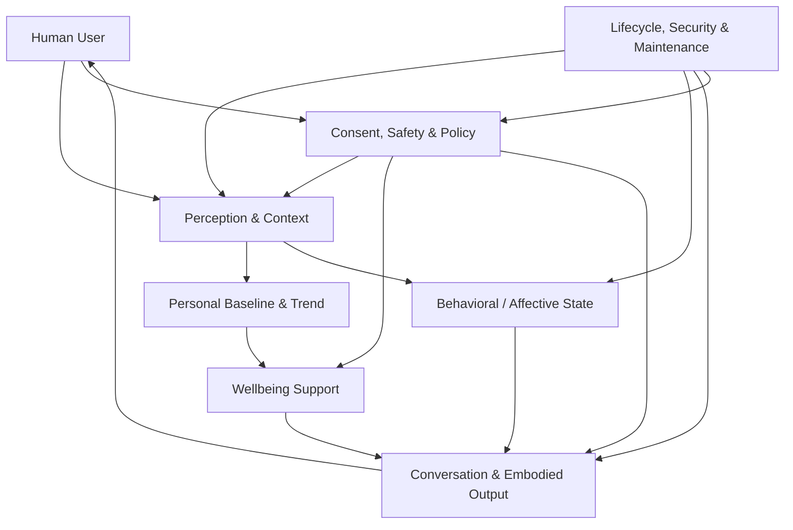

# Conceptual System Architecture

This document consolidates the public architecture for **Embodied Companion Health**. It describes responsibilities and trust boundaries, not a concrete device design.

Implementation-sensitive details such as exact sensor placement, materials, fluid geometry, clinical thresholds, or proprietary control algorithms are intentionally excluded.

## High-level architecture



The important architectural choice is that **no single generative model should directly own perception, memory, health interpretation, consent, and physical action at the same time**.

## 1. Perception and context

The system may receive user-permitted signals such as conversation, proximity, touch, motion, temperature, routine context, environmental state, or optional wellness inputs.

Key requirements:

- modalities are permissioned independently where appropriate;
- uncertainty is represented rather than hidden;
- context inference is reversible;
- sensitive raw data is minimized.

### Speaker-aware conversational perception

Multi-party conversation benefits from a replaceable perception boundary that can represent **who spoke when**, overlapping speech, and turn transitions before higher-level conversational interpretation.

A diarization component may emit generic speaker channels and timestamps, but those channels must not be treated as verified real-world identity. If identity binding is needed, speaker verification or another user-permitted signal should remain a separate step with its own uncertainty and privacy boundary.

A provider-neutral observation may contain fields such as:

- generic speaker channel;
- activity interval or current activity state;
- overlap state;
- turn-start / turn-end evidence;
- confidence or uncertainty;
- source / model provenance and observation latency.

Higher-level semantic logic may use these observations to propose listening, gaze, response-timing, or clarification states. It must not convert uncertain diarization into unsupported identity, consent, or safety authority.

The concrete diarization backend should remain replaceable. Current related work includes NVIDIA Nemotron 3 Diarization, which supports streaming and offline diarization with generic speaker labels, and Voice Arena Diarization-Bench, whose methodology highlights evaluation across speaker count, overlap, acoustic conditions, boundary tolerance, and separate error components.

## 2. Personal baseline and trend layer

This layer asks how current observations compare with the user's own recent normal.

It may maintain derived summaries for areas such as:

- sleep and recovery;
- activity and mobility;
- hydration-related patterns;
- temperature trends;
- user-reported symptoms;
- other validated low-risk observations.

The design should prefer derived trends over indefinite storage of reconstructable raw data.

## 3. Behavioral / affective state

A long-lived companion needs some persistent representation of interaction context so that its behavior does not reset every turn or vary arbitrarily.

The exact representation is an **open research question**. Candidate concepts may include familiarity, comfort, initiative, caution, or interaction energy, but the public project does not assume a fixed psychological model.

This layer influences tone, timing, proximity, and initiative. It does not override safety or consent.

## 4. Wellbeing support

The initial wellbeing role is intentionally limited to:

- trend summaries;
- persistent-deviation detection;
- routine support;
- uncertainty-aware suggestions;
- recommending professional evaluation when appropriate.

Diagnostic or therapeutic functions belong to a separate validation and regulatory track.

## 5. Consent, safety, and policy control plane

Consent and safety are not post-processing filters. They are a control plane that constrains sensing, memory, interpretation, and action.

Examples include:

- immediate stop or pause;
- permission boundaries for sensitive sensing;
- physical force and temperature limits;
- maintenance lockout;
- conservative behavior when consent is ambiguous;
- adult-only boundaries for explicit intimate interaction;
- clinical-claim boundaries;
- user-visible explanation of why a behavior was blocked or changed.

Safety-critical rules should be independently testable from the generative behavior model.

## 6. Conversation and embodied output

Outputs may include:

- language and voice;
- gaze and expression;
- posture and movement;
- proximity and touch;
- wellbeing reminders;
- refusal, pause, or disengagement;
- maintenance requests.

The research problem is coordination. A safe physical companion should not have speech, motion, touch, and refusal generated as unrelated channels.

### Observe–propose–authorize–execute–reobserve boundary

For adaptive actions, the project should distinguish **what the model proposes** from **what the system is allowed to execute**.

A high-level control cycle is:

```text
Observation
  -> bounded action proposal / abstention
  -> deterministic permission, safety, and policy gate
  -> constrained execution
  -> re-observation and outcome verification
```

Action proposals should refer to the currently observed target and state rather than assuming that an earlier observation is still valid. If the target is ambiguous, stale, unsupported, or outside the allowed capability set, the system should remain able to abstain, clarify, or fail closed.

This pattern is consistent with current specialist computer-use research such as CUA-S1, where planning and execution are separated and post-action state is re-observed. The public architecture adopts the **boundary pattern**, not a specific computer-use model or GUI-control implementation.

For future physical embodiment, the same principle applies at a higher safety bar: a model proposal is not authorization, and successful delivery is not assumed until independently observable state confirms the outcome.

## 7. Lifecycle, cyber-physical security, and maintenance

Physical embodiment changes the threat model. A compromised model, plugin, update channel, network service, or actuator controller can become a physical-safety problem.

A mature architecture should therefore consider:

- authenticated and rollback-capable updates;
- bounded actuator authority;
- safe offline or degraded modes;
- separation between generative components and safety-critical control;
- fault detection and emergency stop;
- inspectable maintenance state;
- protection against unauthorized physical control;
- migration of user-controlled preferences and relationship state across model or hardware changes.

Long-term companionship also raises end-of-service questions: what happens if a vendor disappears, a model is retired, or the body is replaced?

## Data classes

A useful public model distinguishes at least:

1. **Ephemeral interaction data** — used momentarily and discarded.
2. **Preferences and user-controlled relationship state** — retained for continuity.
3. **Derived wellbeing trends** — retained only when they provide value.
4. **Highly sensitive raw health or intimate data** — minimized and preferably not retained by default.

Cloud processing should not be assumed for the most sensitive classes.

## Architectural invariants

> **Essential health and safety functions must not require unnecessary intimacy.**

> **A generative model must not be the sole authority for safety-critical physical action.**

> **A companion should become more useful as it learns, without becoming harder for the user to inspect, stop, migrate, or leave.**
